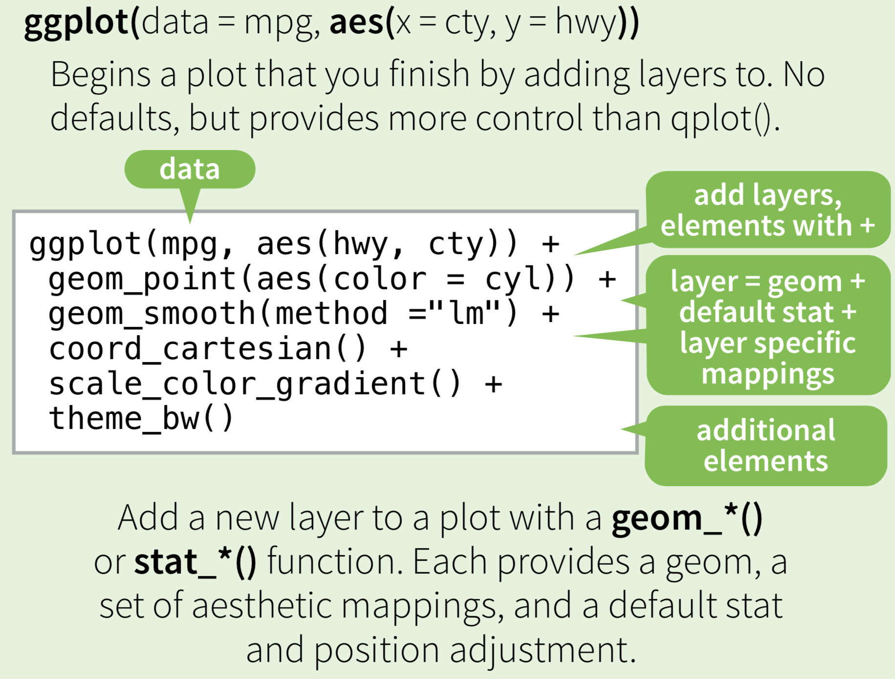

```{r setup, include=FALSE, echo = FALSE, message = FALSE}
knitr::opts_chunk$set(echo=TRUE, warning=FALSE, message=FALSE, dev.args = list(bg = 'transparent'), fig.align='center', fig.height = 3, fig.widht=4)
require('tidyverse')
theme_set(theme_bw() + theme(plot.background=element_blank()) )
```

## topics for today

<span style = "color:white"> &nbsp; </span>

- basics of R
- tidyverse
- tidy data
- data wrangling
- plotting
- Rmarkdown

# R for data science

## R4DS

<div align = 'left' style = "margin-left : 30px">
  
</div>

<div style = "position:absolute; top: 620px; right:60px;">
  freely available online: [R for Data Science](http://r4ds.had.co.nz/)
</div>

## data science?

<div align = 'center'>
  
</div>

<div style = "position:absolute; top: 620px; right:60px;">
  read [more](https://priceonomics.com/whats-the-difference-between-data-science-and/)
</div>

## what R is (not)


- special purpose programming language for ~~data science~~ <span style = "color:firebrick">statistical computing</span>

    - statistics, data mining, data visualization

- [authority](https://rviews.rstudio.com/2017/02/22/how-to-teach-r-common-mistakes/) says to tell you to 
<span style = "color:firebrick">not think of R as a programming language!</span>

- think of it as a tool optimized for creating scripts to <span style = "color:firebrick">manipulate, plot and analyze data</span>

<div align = 'center'>
  
</div>

## past & present

<div style = "float:left; width:35%;">
- a trusted old friend from 1993  
- still thriving
    - see TIOBE ranking (based on search query results)
</div>
<div style = "float:right; width:60%;">
<div align = 'center'>
  
</div>
</div>  

## extensibility & community support

a lot of innovation and development takes place in <span style = "color:firebrick">packages</span>

go browse some 12,000 packages on [CRAN](https://cran.r-project.org/web/packages/)

<span style = "color:white"> &nbsp; </span>

<div style = "float:left; width:45%;">
install packages (only once)

```{r, eval = F}
install.packages('tidyverse')
```
</div>
<div style = "float:right; width:45%;">
load packages (for every session)

```{r, eval = F}
library(tidyverse)
```  
</div>  

## base R & package functions

<div style = "float:left; width:45%;">

base R functionality is always available

```{r}
x = seq(from = 1, to = 10, length.out = 1000)
plot(x,x^2)
```
  
</div>
<div style = "float:right; width:45%;">

packages bring extra functions

```{r}
library(ggplot2)
ggplot2::qplot(x,x^2)
```
  
</div>  

## tidyverse

<span style = "color:white"> &nbsp; </span>

<div align = 'center'>
  
</div>

<div style = "position:absolute; top: 620px; right:60px;">
  [tidyverse website](https://www.tidyverse.org)
</div>


## RStudio

integrated development environment for R

<div align = 'center'>
  
</div>

<div style = "position:absolute; top: 620px; right:60px;">
 [cheat sheet](https://www.rstudio.com/wp-content/uploads/2016/01/rstudio-IDE-cheatsheet.pdf)
</div>


# basics of R

## overview

- basic properties of R
- data types
    - numbers, vectors & matrices
    - characters & factors
    - lists, data.frames & tibbles
- probability distributions
- functional programming elements
- functions

<div style = "position:absolute; top: 620px; right:60px;">
  for all base R stuff, check the [R manual](https://cran.r-project.org/doc/manuals/r-release/R-intro.pdf)
</div>

## general remarks about R

<div style = "float:left; width:45%;">

- free (GNU General Public License)
- interpreted language
```{r}
6 * 7
```

- vector/matrix based
```{r}
x = c(1,2,3)
x + 1
```

</div>
<div style = "float:right; width:45%;">

- supports object-oriented, procedural & functional styles

- convenient interfaces to other languages

- assignment in both directions possible
```{r}
x <- 3
3 -> y
x == y
```


</div>  

## help

<span style = "color:white"> &nbsp; </span>

```{r, eval = F}
help('qplot')
```


    qplot {ggplot2}	R Documentation
    Quick plot

    Description

    qplot is a shortcut designed to be familiar if you're used to base plot(). It's a convenient
    wrapper for creating a number of different types of plots using a consistent calling scheme.  
    It's great for allowing you to produce plots quickly, but I highly recommend learning ggplot()
    as it makes it easier to create complex graphics.

    Usage

    qplot(x, y = NULL, ..., data, facets = NULL, margins = FALSE,
      geom = "auto", xlim = c(NA, NA), ylim = c(NA, NA), log = "",
      main = NULL, xlab = deparse(substitute(x)),
      ylab = deparse(substitute(y)), asp = NA, stat = NULL, position = NULL)


## numbers, vectors & matrics

<div style = "float:left; width:45%;">

- standard number precision is double

```{r}
typeof(2)
```


- vectors are declared using `c()`
```{r}
x = c(10,20,30)
x
```

</div>
<div style = "float:right; width:45%;">

- everything is a vector (possibly length 1)

```{r}
c(length(200), length("huhu"))
```

- indexing starts at 1

```{r}
x[2]
```

</div>  

## numbers, vectors & matrices (2)


<div style = "float:left; width:45%;">

- column-major mode

```{r}
m = matrix(c(1,2,3,4,5,6), nrow = 2)
m
m[1,]
```
  
</div>
<div style = "float:right; width:45%;">
- vectors are column vectors
```{r}
m %*% x ## dot product
```

</div>    


## character vectors and factors

<div style = "float:left; width:45%;">

- strings are called characters

```{r}
typeof("huhu")
```

- vector of characters

```{r}
chr.vector = c("huhu", "hello", "huhu", "ciao")
chr.vector
```

</div>
<div style = "float:right; width:45%;">

- factors track levels

```{r}
factor(chr.vector)
```

- ordered factors arrange their levels

```{r}
factor(chr.vector, ordered = T, 
       levels = c("huhu", "ciao", "hello"))
```

</div>  


## lists & data frames

<div style = "float:left; width:45%;">

- lists are key-value pairs

```{r}
my.list = list(dudu = 1,
               chacha = c("huhu", "ciao"))
```

- data frames as lists of same-length vectors

```{r}
exp.data = data.frame(trial = 1:5,
              condition = factor(c("C1", "C2", "C1", 
                                   "C3", "C2"),
                                 ordered = T),
              response = c(121, 133, 119, 102, 156))
exp.data
```


</div>
<div style = "float:right; width:45%;">

- access colums

```{r}
exp.data$condition
```

- access rows

```{r}
exp.data[3,]
```

</div>  

## tibbles

<div style = "float:left; width:45%;">

- tibbles are data frames in the tidyverse

```{r}
as.tibble(exp.data)
```

</div>
<div style = "float:right; width:45%;">

- compare to previous data frame

```{r}
exp.data
```

<span style = "color:white"> &nbsp; </span>
<span style = "color:white"> &nbsp; </span>

</div>  


<div>

<span style = "color:white"> &nbsp; </span>
<span style = "color:white"> &nbsp; </span>

- some differences

```{r, eval = FALSE}
my.tibble    = tibble(x = 1:10, y = x^2)      ## dynamic construction possible
my.dataframe = data.frame(x = 1:10, y = x^2)  ## ERROR :/
```

</div>


## probability distributions in R

- R has many built-in probability distributions
    - normal distribution
    - beta distribution
    - ...
- additional distributions supplied by packages
    - multi-variate normal
    - Dirichlet
    - ...
- each distribution `mydist` is associated with four functions:
    1. `dmydist(x, ...)` gives the probability (mass/density) $f(x)$ for `x`
    2. `pmydist(x, ...)` gives the cumulative distribution function $F(x)$ for `x`
    3. `qmydist(p, ...)` gives the value $x$ for which `p = pmydist(x, ...)`
    4. `rmydist(n, ...)` returns `n` samples from the distribution


## example

```{r}
x = seq(-5, 5, length.out = 1000)
y = dnorm(x, mean = 1, sd = 0.5)
plot(x,y)
```


## maps & pipes (tidyverse)

<div style = "float:left; width:45%;">

- mapping

```{r}
data = tibble(IQ = c(100,110,120,125), 
              RT = c(67,58,98,80) )
map_dbl(data, mean)
```
  
</div>
<div style = "float:right; width:45%;">

- piping 

```{r}
tibble(IQ = c(100,110,120,125), 
              RT = c(67,58,98,80) ) %>% 
  map_dbl(mean)
```
  
</div>  


## functions

<div style = "float:left; width:45%;">

- named custom functions

```{r}
crazy.operation = function(x,y) {
  x+y
}
crazy.operation(2,3)
```

  
</div>
<div style = "float:right; width:45%;">

- anonymous functions

```{r}
tibble(IQ = c(100,110,120,125), 
              RT = c(67,58,98,80) ) %>% 
  map_dbl(function(i) {max(i)-min(i)})
```
  
</div>  

# tidy (rectangular) data

## types of data

<span style = "color:white"> &nbsp; </span>

data from experimental (psych) studies is usually <span style = "color:firebrick">rectangular data</span>

<span style = "color:white"> &nbsp; </span>

examples of (usually) non-rectangular data:

- image data
- sound data
- video data
- corpora
- ...

<span style = "color:white"> &nbsp; </span>

the tidyverse is particularly efficient for dealing with <span style = "color:firebrick">tidy rectangular data</span> 

## rectangular data

```{r}
library(nycflights13)
nycflights13::flights
```

<div style = "position:absolute; top: 620px; right:60px;">
  study Chapters 5 and 12 from [R for Data Science](http://r4ds.had.co.nz)
</div>

## tidy data

1. each variable is a column
2. each observation is a row
3. each value is a cell

<span style = "color:white"> &nbsp; </span>

<div align = 'center'>
  
</div>

## untidy data 1

<div style = "float:left; width:45%;">
  
this is untidy if we want to analyze/plot `grade` as a function of `exam` type

```{r}
grades = tibble(name = c('Michael', 'Noa', 'MadEye'),
                midterm = c(3.7, 1.0, 1.3),
                final = c(4.0, 1.3, 1.0))
grades
```

</div>
<div style = "float:right; width:45%;">
  
to tidy up, we need to <span style = "color:firebrick">gather</span> columns which are not separate variables into a new column

```{r}
grades %>% gather('midterm', 'final', 
                  key = 'exam', value = 'grade')
```

</div>  

## untidy data 2

<div style = "float:left; width:45%;">

this is untidy if we want to analyze `grade` as a function of `participation`

```{r}
results = tibble(name = c('Michael', 'Noa', 'MadEye', 
                          'Michael', 'Noa', 'MadEye'),
                 what = rep(c('grade', 'participation'), 
                            each = 3),
                 howmuch = c(3.7, 1.0, 1.0, 55, 100, 100))
results
```

  
</div>
<div style = "float:right; width:45%;">
  
to tidy up, we need to <span style = "color:firebrick">spread</span> cells from a row out over several columns

```{r}
results %>% spread(key = 'what', value = 'howmuch')
```


</div>  

# ggplot

## Layered grammar of graphics

<div style = "float:left; width:45%;">
- structured description language for plots (relevant for data science)  
- smart system of defaults  
- multiple layers:
    - data + transformation + geom. object + aesthetics
</div>
<div style = "float:right; width:45%;">
- basic components:
    - data
    - coordinate system
    - statistical transformation
        - means, standard errors, bins, ...
    - scales
        - continuous, discrete, ...
    - geometric object
        - how to visualize the data (points, bars, lines, ...)
    - aesthetic mapping
        - point shape, size, color, ...
    - facets
</div>  

<div style = "position:absolute; top: 620px; right:60px;">
  for background see [Wickham (2010)]()
</div>

## example

<div style = "float:left; width:45%;">

<span style = "color:firebrick">fully explicit</span>

```{r}
ggplot() +
  layer(
    data = diamonds,
    mapping = aes(x = carat, y = price),
    geom = "point",
    stat = "identity",
    position = "identity"
  ) +
  scale_x_continuous() +
  scale_y_continuous() +
  coord_cartesian()
```  
</div>
<div style = "float:right; width:45%;">

<span style = "color:firebrick">with syntactic sugar and defaults</span>

```{r}
diamonds %>% ggplot(aes(carat, price)) + geom_point()
``` 
</div>  


## general structure of a `ggplot` call

<div align = 'center'>
  
</div>

<div style = "position:absolute; top: 620px; right:60px;">
  from the [cheat sheet](https://www.rstudio.com/wp-content/uploads/2015/03/ggplot2-cheatsheet.pdf)
</div>


# Rmarkdown

## why Rmarkdown

<span style = "color:white"> &nbsp; </span>

<div style = "float:left; width:55%;">
  
- prepare, analyze & plot data right inside your document

- hand over all of your work in one single, easily executable chunk
    - support reproducible and open research

- export to a variety of different formats

</div>
<div style = "float:right; width:35%;">

<div align = 'center'>
  
</div>

</div>  


## flow of information

<span style = "color:white"> &nbsp; </span>


<div align = 'center'>
  
</div>

<span style = "color:white"> &nbsp; </span>


<div align = 'center'>
  
</div>

## markdown

<div style = "float:left; width:45%;">

headers & sections

```{markdown}
# header 1
## header 2
### header 3
```

emphasis, highlighting etc.

```{markdown}
*italics* or _italics_
**bold** or __italics__
~~strikeout~~
```

</div>
<div style = "float:right; width:45%;">

links

```{markdown}
[link](https://www.google.com)
```

inline code & code blocks

```{markdown}
`function(x) return(x - 1)`
```

  
</div>  

 
<div style = "position:absolute; top: 620px; right:60px;">
  [cheat sheet](https://github.com/adam-p/markdown-here/wiki/Markdown-Cheatsheet)
</div>


## Rmarkdown

extension of markdown to dynamically integrate R output

multiple output formats:

- HTML pages, HTML slides (here), ...
- PDF, LaTeX, Word, ...


<div style = "position:absolute; top: 620px; right:60px;">
  [cheat sheet](https://www.rstudio.com/wp-content/uploads/2015/02/rmarkdown-cheatsheet.pdf) and a [quick tour](http://rmarkdown.rstudio.com/authoring_quick_tour.html)
</div>

## supports LaTeX

inline equations with `$\theta$`

equation blocks with

    $$ \begin{align*} E &= mc^2 \\
    & = \text{a really smart forumla}
    \end{align*} $$


<span style = "color:white"> &nbsp; </span>

<span style = "color:firebrick">caveat</span>

LaTeX-style formulas will be rendered differently depending on the output method:

- PDF-LaTeX gives you genuine LaTeX with (almost) all abilities 
- HTML output uses [MathJax](https://math.meta.stackexchange.com/questions/5020/mathjax-basic-tutorial-and-quick-reference) to emulate LaTeX-like behavior
    - only LaTeX-packages & functionality emulated in JS will be available

